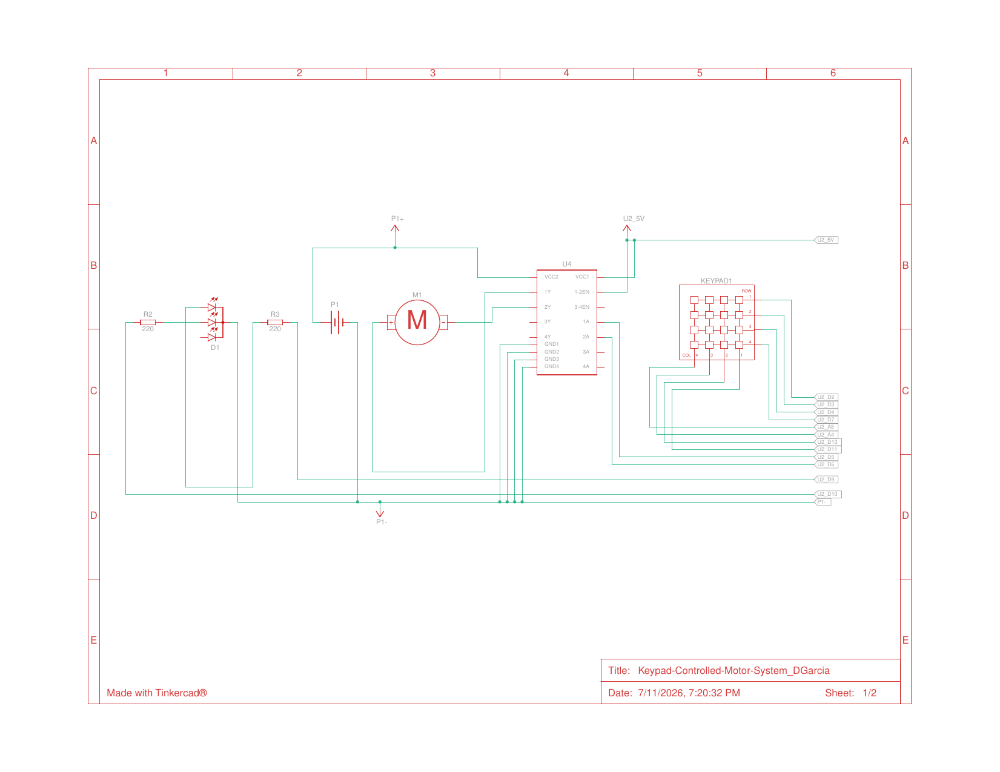
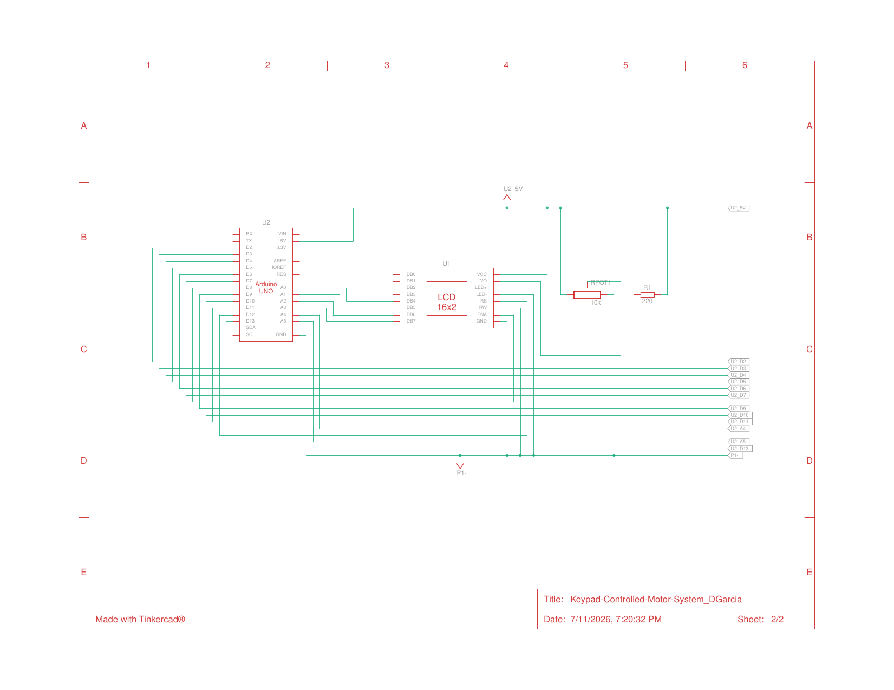

# Keypad Motor Control Station

An operator control station for a DC motor: 4x4 matrix keypad input, L293D H-bridge drive, 16x2 LCD status display, and an emergency stop — the same pattern used on real conveyor and machine controls.

**Course:** RBT173 Lab 5.2 · **Tools:** Arduino (C++), Tinkercad, L293D

**Demo:** [Watch on YouTube](https://youtu.be/8WzRRm6X5mk) · **Circuit:** [View simulation on Tinkercad](https://www.tinkercad.com/things/0oNOJVe9sRp-keypad-controlled-motor-systemdgarcia?sharecode=VmeTZ6O93QFIhA1nFL1xzEjNX9wmKZ72ki4wSKl7mBY)

## Degree Objective

**Objective 1 — Design and complete robotic and embedded systems solutions that address real-world situations and challenges.**

Industrial motor stations need speed selection, direction control, clear status feedback, and a stop that always works. This project implements that control pattern end to end on embedded hardware.

## How It Works

Keys 0–9 set a speed level mapped to PWM duty, `#` toggles start/pause, `A` reverses direction, and `*` is a hard stop that cuts both H-bridge inputs and clears state. The motor runs from a separate 9 V rail on the L293D's Vcc2 while logic stays on 5 V with a common ground. A 16x2 LCD shows run state, direction, and speed level in real time.

## Engineering Highlights

- **Safe-by-default state machine:** the motor powers up stopped, speed 0 pauses the drive, and `hardStop()` forces both H-bridge inputs low before clearing state.
- **Modular structure:** input handling, motor drive, and LCD display are isolated into small single-purpose functions (`applyMotor`, `pwmFromLevel`, `toggleDir`), which made the logic easy to test and extend.
- **Power discipline:** separate motor and logic supplies with shared ground — the same practice used to keep inductive noise off logic rails in real machines.

## Schematic

Sheet 1 — motor drive: L293D H-bridge, DC motor on separate 9 V rail, keypad matrix.

Sheet 2 — operator display: 16x2 LCD with contrast pot on the shared 5 V logic rail.

## Files

- `keypad_motor_controller.ino` — full commented source
- `keypad-motor-controller_schematic_p1.png` / `_p2.png` — circuit schematic (Tinkercad, 2 sheets)

## Links

- Demo video: https://youtu.be/8WzRRm6X5mk
- Tinkercad simulation: [Keypad-Controlled Motor System](https://www.tinkercad.com/things/0oNOJVe9sRp-keypad-controlled-motor-systemdgarcia?sharecode=VmeTZ6O93QFIhA1nFL1xzEjNX9wmKZ72ki4wSKl7mBY)
- Portfolio: https://www.garciarobotics.com/
